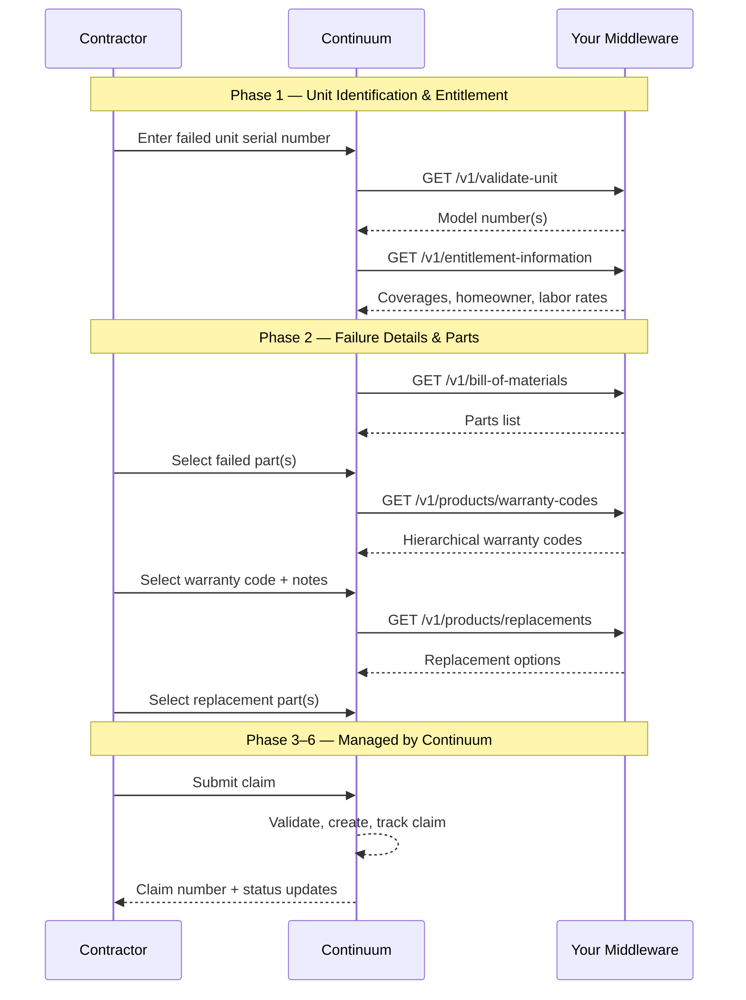

## Overview

Claims processing is the primary automation target. When a contractor diagnoses a failure on a consumer's unit, Continuum handles the full lifecycle: entitlement check, parts selection, claim submission, tracking, and resolution.

Your middleware powers the **first two phases** — unit identification, entitlement, and parts/warranty code lookups. The remaining phases (claim creation, tracking, attachments, resolution) are managed within Continuum.

## Sequence

## Phase 1: Unit identification & entitlement check

This phase uses your API to validate the unit and determine what's covered.

<Steps>
  <Step title="Validate serial number">
    Contractor enters the serial number of the failed unit. Continuum calls [`GET /v1/validate-unit`](/api-reference/unit-data/validate-unit) to confirm it exists and retrieve the model number(s). If multiple models are associated, the contractor selects the correct one.
  </Step>
  <Step title="Check entitlement">
    Continuum calls [`GET /v1/entitlement-information`](/api-reference/unit-data/entitlement-information) with the serial, model, and optionally the customer ID, state code, and installation type. The response includes:

    - **Warranty validity** — is the serial under any active coverage?
    - **Coverage tiers** — tank, parts, labor each with individual status and expiration
    - **Pro-rated schedules** — if any tier is pro-rated, the reimbursement schedule
    - **Labor rates** — applicable labor/travel reimbursement rates for this region
    - **Claim deadline** — days from failure within which a claim must be submitted
    - **Homeowner details** — name, address, contact info
    - **Distributor/purchaser details** — who sold the unit

    Continuum uses this to determine whether the claim can proceed and what the contractor will be reimbursed.
  </Step>
</Steps>

## Phase 2: Failure details & parts selection

This phase uses your API to let the contractor describe the failure and select replacement parts.

<Steps>
  <Step title="Get bill of materials">
    Continuum calls [`GET /v1/bill-of-materials`](/api-reference/parts/bill-of-materials) to retrieve the parts list for this serial/model. The contractor identifies which part(s) failed.
  </Step>
  <Step title="Get warranty codes">
    For each failed part, Continuum calls [`GET /v1/products/warranty-codes`](/api-reference/parts/warranty-codes) to retrieve the hierarchical disposition code tree. The contractor navigates the tree to classify the failure (e.g., Electrical → Thermostat → Failed to regulate temperature) and adds notes.
  </Step>
  <Step title="Get replacement parts">
    For each failed part, Continuum calls [`GET /v1/products/replacements`](/api-reference/parts/replacements) to find suitable replacements. Results include exact matches, superseded parts, and optionally non-OEM alternatives, each with availability and pricing.
  </Step>
  <Step title="Complete claim details">
    The contractor fills in remaining details: homeowner info (pre-filled from entitlement), contractor info, labor hours, travel miles, and any notes. The entitlement response's labor rates tell the contractor what they'll be reimbursed.
  </Step>
</Steps>

## Phases 3–6: Managed by Continuum

The remaining phases are handled within Continuum's platform and do **not** call your middleware:

**Phase 3 — Claim submission:** Continuum validates the claim and creates it in its system. The claim number is returned to the contractor.

**Phase 4 — Attachments:** If the warranty code or claim type requires supporting documentation (photos of the rating plate, failed part, etc.), the contractor uploads them through Continuum.

**Phase 5 — Tracking & resolution:** Continuum tracks the claim through its lifecycle: `PENDING` → `APPROVED` → `PAID` (or `DENIED`, `NEED_CORRECTIONS`, etc.). If corrections are needed, the contractor is notified and updates the claim.

**Phase 6 — Closure:** The claim reaches a terminal state. If parts were requested for return, the return process is managed through Continuum.

## Endpoints involved (your middleware)

| Endpoint | Phase | Purpose |
|----------|-------|---------|
| [`GET /v1/validate-unit`](/api-reference/unit-data/validate-unit) | 1 | Validate serial, get model |
| [`GET /v1/entitlement-information`](/api-reference/unit-data/entitlement-information) | 1 | Coverage tiers, labor rates, homeowner info |
| [`GET /v1/bill-of-materials`](/api-reference/parts/bill-of-materials) | 2 | Parts list for failure selection |
| [`GET /v1/products/warranty-codes`](/api-reference/parts/warranty-codes) | 2 | Disposition code tree |
| [`GET /v1/products/replacements`](/api-reference/parts/replacements) | 2 | Replacement part options |

## Claim statuses (reference)

These are the statuses a claim moves through within Continuum. You don't need to implement anything for these, but they're useful context:

| Status | Description |
|--------|-------------|
| `PENDING` | Claim submitted, awaiting review |
| `APPROVED` | Claim approved |
| `DENIED` | Claim denied |
| `NEED_CORRECTIONS` | Corrections required from the contractor |
| `NEED_SERIAL_NUMBER` | Part serial number needed |
| `RETURN_PRODUCT` | Failed part requested for return |
| `PRODUCT_COLLECTED` | Returned part received |
| `READY_FOR_PICKUP` | Replacement ready for pickup |
| `PICKED_UP` | Replacement picked up |
| `PAID` | Claim paid / credit issued |
| `CANCELLED` | Claim cancelled |
| `ERROR` | System error during processing |
