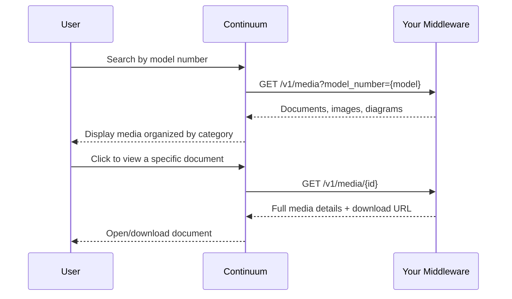

## Overview

The media center gives consumers and contractors access to product documentation — installation guides, service manuals, spec sheets, wiring diagrams, part images, and more. Continuum retrieves all media through a single unified endpoint on your middleware.

## Sequence

## How it works

<Steps>
  <Step title="Search by model or part">
    A user searches for documentation by model number (from the media center page) or arrives via a part listing. Continuum calls [`GET /v1/media`](/api-reference/media/get-media) with either `model_number` or `part_number` as a query parameter.
  </Step>
  <Step title="Display results">
    Continuum displays the results organized by category — installation guides, service manuals, wiring diagrams, product photos, etc. Each item shows a title, category, file type, and preview image when available.
  </Step>
  <Step title="Access a specific item">
    When a user clicks on a media item, Continuum can use the `url` from the list response directly, or call [`GET /v1/media/{id}`](/api-reference/media/get-media-by-id) for the full details.
  </Step>
</Steps>

## Unified media model

All media types — documents, images, videos, diagrams — are served through the same endpoint and share the same `MediaItem` schema. This means your middleware returns installation guides and part photos from the same endpoint, distinguished by `mediaType` and `category`.

Your middleware is responsible for sourcing media from wherever it lives internally — a document management system, shared drive, CDN, product database, etc. Continuum only needs URLs in the response.

## Manual uploads

If your systems don't have API-accessible media for certain models, you can also upload media directly through `POST /v1/media`. This is useful for adding documentation that exists as files but isn't in your digital asset system yet.

## Endpoints involved

| Endpoint | Purpose |
|----------|---------|
| [`GET /v1/media`](/api-reference/media/get-media) | Retrieve media by model number or part number |
| [`GET /v1/media/{id}`](/api-reference/media/get-media-by-id) | Retrieve a specific media item by ID |
| [`POST /v1/media`](/api-reference/media/upload-media) | Upload media manually |
