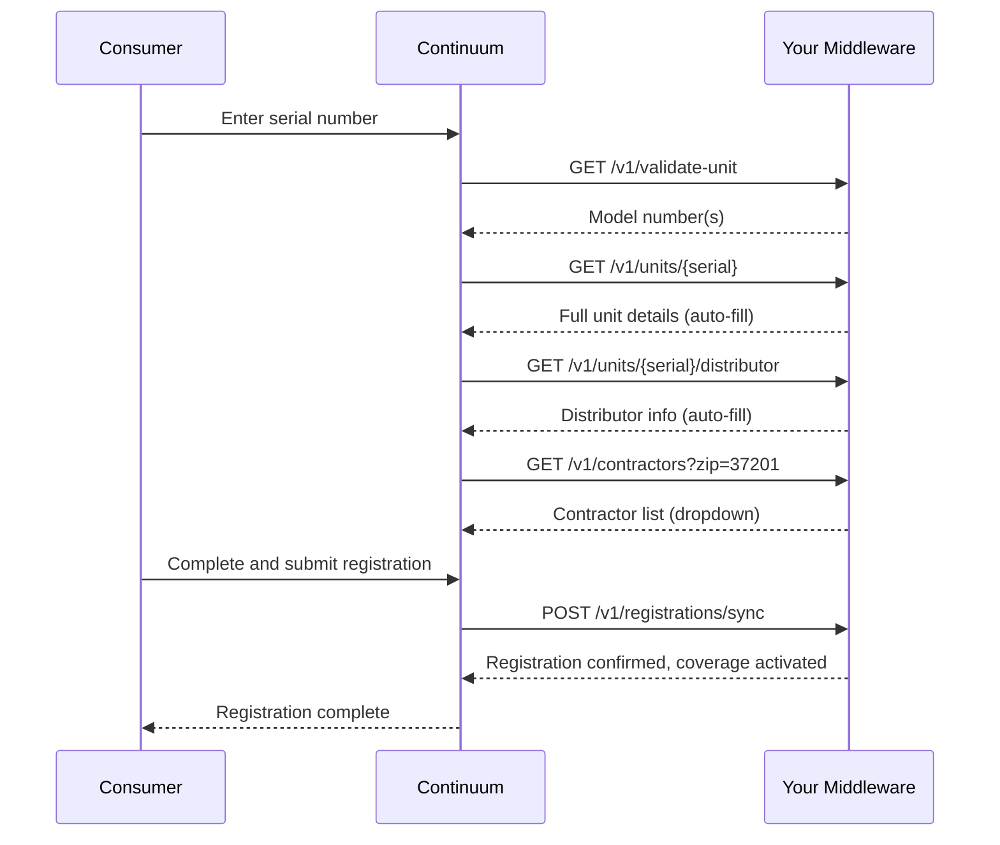

## Overview

When a consumer registers their product through Continuum's portal, several API calls happen behind the scenes to validate the serial number, auto-fill product and distributor fields, and ultimately sync the registration back to your system.

## Sequence

## Step by step

<Steps>
  <Step title="Serial validation">
    Consumer enters a serial number. Continuum calls [`GET /v1/validate-unit`](/api-reference/unit-data/validate-unit) to confirm it exists and get the model number. If multiple models are associated (multi-component systems), the consumer selects the correct one.
  </Step>
  <Step title="Auto-fill product fields">
    Continuum calls [`GET /v1/units/{serial_number}`](/api-reference/unit-data/get-unit) to retrieve the full unit record. Product name, model, brand, and manufacturing details are auto-filled on the form.
  </Step>
  <Step title="Auto-fill distributor">
    Continuum calls [`GET /v1/units/{serial_number}/distributor`](/api-reference/unit-data/unit-distributor) to look up the distributor that sold the unit. Distributor name and details are auto-filled.
  </Step>
  <Step title="Contractor selection">
    If the consumer had a contractor install the product, Continuum calls [`GET /v1/contractors`](/api-reference/reference-data/contractors) with the consumer's zip code to populate a contractor dropdown.
  </Step>
  <Step title="Consumer completes the form">
    Consumer enters remaining details: installation date, installation type (residential/commercial/multi-family), and their contact information.
  </Step>
  <Step title="Registration sync">
    Continuum calls [`POST /v1/registrations/sync`](/api-reference/registration/registration-sync) to push the registration to your system. Your middleware writes the registration to your warranty database and returns whether warranty coverage was activated or extended.
  </Step>
</Steps>

## Endpoints involved

| Endpoint | Purpose |
|----------|---------|
| [`GET /v1/validate-unit`](/api-reference/unit-data/validate-unit) | Confirm serial exists, get model |
| [`GET /v1/units/{serial_number}`](/api-reference/unit-data/get-unit) | Auto-fill product details |
| [`GET /v1/units/{serial_number}/distributor`](/api-reference/unit-data/unit-distributor) | Auto-fill distributor |
| [`GET /v1/contractors`](/api-reference/reference-data/contractors) | Contractor directory search |
| [`POST /v1/registrations/sync`](/api-reference/registration/registration-sync) | Push registration to your system |

## Why registration sync matters

Registration affects warranty terms. Without the sync, your system doesn't know the unit is registered, which can result in shorter coverage or claims being denied. The registration sync endpoint should:

- Record the registration in your warranty database
- Set the warranty effective date based on the installation date
- Activate or extend coverage if your warranty program rewards registration
- Return any coverage adjustments so Continuum can display accurate warranty info immediately
