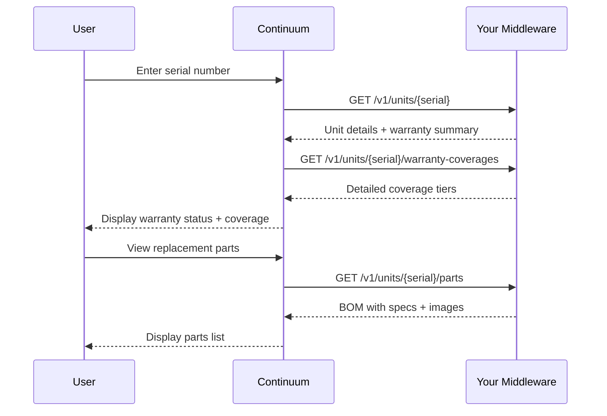

## Overview

When a consumer, contractor, or distributor enters a serial number on the warranty verification page, Continuum retrieves the full unit details, coverage tiers, and replacement parts from your system.

## Sequence

## Step by step

<Steps>
  <Step title="Serial lookup">
    User enters a serial number. Continuum calls [`GET /v1/units/{serial_number}`](/api-reference/unit-data/get-unit) to get the full unit record — product info, manufacturing data, sales info, and the high-level warranty summary.
  </Step>
  <Step title="Coverage details">
    Continuum calls [`GET /v1/units/{serial_number}/warranty-coverages`](/api-reference/unit-data/warranty-coverages) to get the detailed coverage tiers. The portal displays each tier (tank, parts, labor) with its status, dates, and any pro-rated schedule.
  </Step>
  <Step title="Replacement parts">
    If the user wants to see replacement parts, Continuum calls [`GET /v1/units/{serial_number}/parts`](/api-reference/unit-data/unit-parts). The portal displays serviceable parts with images, specifications, stock status, and cross-references.
  </Step>
  <Step title="Documentation">
    The user can also access product documentation. Continuum calls [`GET /v1/media?model_number={model}`](/api-reference/media/get-media) to retrieve manuals, spec sheets, and diagrams.
  </Step>
</Steps>

## What the user sees

The warranty verification page displays:

- **Product identification** — model, serial, brand, product line
- **Warranty status** — overall status (active, partial, expired) with the effective date
- **Coverage breakdown** — each tier shown individually with its own status and expiration
- **Pro-rated schedule** — if any tier is pro-rated, the reimbursement schedule is shown
- **Registration status** — whether the product is registered and if it affects coverage
- **Replacement parts** — BOM with images, specs, and availability
- **Product documentation** — manuals and diagrams available for download

## Endpoints involved

| Endpoint | Purpose |
|----------|---------|
| [`GET /v1/units/{serial_number}`](/api-reference/unit-data/get-unit) | Full unit details |
| [`GET /v1/units/{serial_number}/warranty-coverages`](/api-reference/unit-data/warranty-coverages) | Detailed coverage tiers |
| [`GET /v1/units/{serial_number}/parts`](/api-reference/unit-data/unit-parts) | Replacement parts with specs |
| [`GET /v1/media`](/api-reference/media/get-media) | Product documentation |
