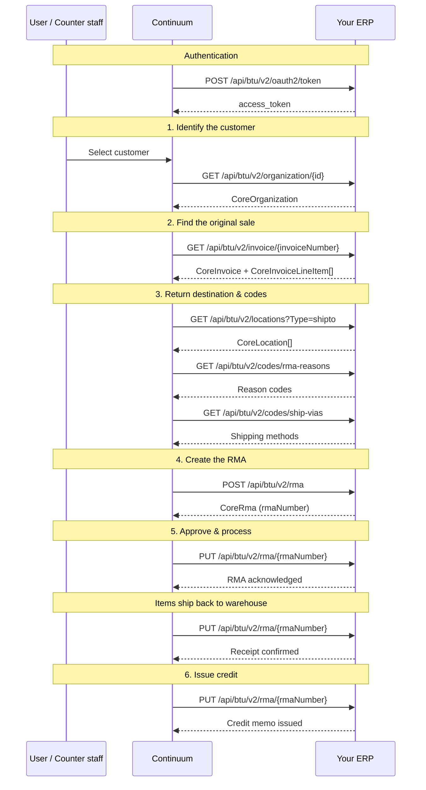

## Overview

A return starts when a distributor's customer reports a non-defect issue (wrong item, overstock, damage in transit) and ends when the credit is issued against their account.

<Accordion title="Endpoints in this diagram → API reference">

| Step | Method | V2 endpoint | API reference | V2 entity |
|------|--------|-------------|---------------|-----------|
| Auth | POST | `/api/btu/v2/oauth2/token` | [Authentication](/getting-started/authentication) | — |
| 1 | GET | `/api/btu/v2/organization/{id}` | [Customer details](/api-reference/customers/customer-details) | [CoreOrganization](/data-types/core-objects#coreorganization) |
| 2 | GET | `/api/btu/v2/invoice/{invoiceNumber}` | [Invoice details](/api-reference/invoices/invoice-details) | [CoreInvoice](/data-types/core-objects#coreinvoice) |
| 3 | GET | `/api/btu/v2/locations?Type=shipto` | [Customer locations](/api-reference/customers/locations) | [CoreLocation](/data-types/core-objects#corelocation) |
| 3 | GET | `/api/btu/v2/codes/rma-reasons` | [RMA reason codes](/api-reference/codes/rma-reasons) | — |
| 3 | GET | `/api/btu/v2/codes/ship-vias` | [Ship via codes](/api-reference/codes/ship-vias) | — |
| 4 | POST | `/api/btu/v2/rma` | [Create return](/api-reference/returns/create-return) | [CoreRma](/data-types/core-objects#corerma) |
| 5 | PUT | `/api/btu/v2/rma/{rmaNumber}` | [Acknowledge](/api-reference/returns/acknowledge) · [Receive](/api-reference/returns/receive) | [CoreRma](/data-types/core-objects#corerma) |
| 6 | PUT | `/api/btu/v2/rma/{rmaNumber}` | [Credit lines](/api-reference/returns/credit-lines) | [CoreRma](/data-types/core-objects#corerma) |

</Accordion>

## Step by step

### 1. Identify the customer

[`GET /api/btu/v2/organization/{id}`](/api-reference/customers/customer-details) — Continuum looks up the customer account in your ERP. Returns a [`CoreOrganization`](/data-types/core-objects#coreorganization) entity. Confirms the customer exists, verifies their status, and retrieves identifiers needed for downstream calls.

### 2. Find the original sale

[`GET /api/btu/v2/invoice/{invoiceNumber}`](/api-reference/invoices/invoice-details) — Continuum finds the original sales invoice tied to the product being returned. Returns a [`CoreInvoice`](/data-types/core-objects#coreinvoice) with embedded [`CoreInvoiceLineItem[]`](/data-types/core-objects#coreinvoicelineitem). This establishes what was sold, when, at what price, and the exact line items with quantities and serial numbers.

### 3. Determine return destination and codes

[`GET /api/btu/v2/locations?Type=shipto`](/api-reference/customers/locations) — Continuum looks up the customer's ship-to addresses as [`CoreLocation`](/data-types/core-objects#corelocation) entities to determine where the returned items should be sent.

<Info>
**Why this order?** Invoice lookup comes before ship-to locations intentionally. Continuum needs to understand the original sale before it can determine the correct return destination.
</Info>

[`GET /api/btu/v2/codes/rma-reasons`](/api-reference/codes/rma-reasons) — Valid return reason codes (e.g., wrong item, damaged in transit, overstock).

[`GET /api/btu/v2/codes/ship-vias`](/api-reference/codes/ship-vias) — Available shipping methods for the return.

### 4. Create the RMA

[`POST /api/btu/v2/rma`](/api-reference/returns/create-return) — With all the reference data in hand, Continuum creates the RMA in your ERP. The request is a [`CoreRma`](/data-types/core-objects#corerma) entity with [`CoreAccountLocation`](/data-types/core-objects#coreaccountlocation) for addresses and [`CoreRmaReturnItem[]`](/data-types/core-objects#corermareturniitem) for line items.

### 5. Approve and process

[`PUT /api/btu/v2/rma/{rmaNumber}`](/api-reference/returns/acknowledge) — Continuum updates the [`CoreRma`](/data-types/core-objects#corerma) status to signal the RMA has been reviewed and approved for processing.

*Physical items ship back to the warehouse.*

[`PUT /api/btu/v2/rma/{rmaNumber}`](/api-reference/returns/receive) — Once items arrive, Continuum updates the RMA with receipt details. This records what was actually received, which may differ from what was expected.

### 6. Issue credit

[`PUT /api/btu/v2/rma/{rmaNumber}`](/api-reference/returns/credit-lines) — Continuum updates the RMA to issue the credit. The ERP creates a credit memo and the customer's account is credited.

---

## Also used in: warranty flow

The same RMA update operations (acknowledge, receive, credit) are used at the end of a warranty event to finalize a draft RMA and issue a credit that offsets the replacement sales order. In V2, these are all `PUT` operations on the [`CoreRma`](/data-types/core-objects#corerma) entity — the action is expressed via the status field and the fields being updated.

[See the full warranty flow →](/warranty-hub/warranty-flow)
