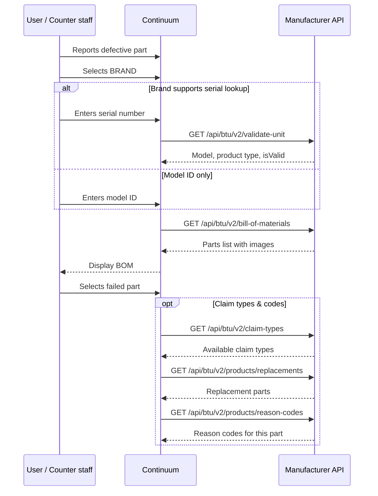
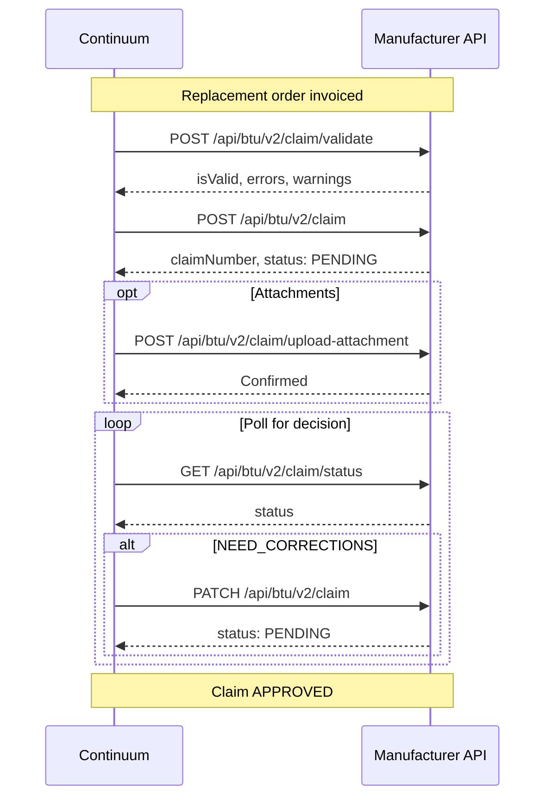

## Overview

The Claims Hub participates in two phases of the warranty event. Phase 1 happens before the replacement order; Phase 3 happens after the replacement order is invoiced.

---

## Phase 1: Identify the defect

The customer reports a defective part. Continuum identifies what failed using the manufacturer's API.

<Accordion title="Endpoints → API reference">

| Method | V2 endpoint | API reference | Notes |
|--------|-------------|---------------|-------|
| GET | `/api/btu/v2/validate-unit` | [Validate unit](/api-reference/unit-data/validate-unit) | Conditional — serial lookup brands only |
| GET | `/api/btu/v2/bill-of-materials` | [Bill of materials](/api-reference/parts/bill-of-materials) | Full parts list for the unit |
| GET | `/api/btu/v2/claim-types` | *(Claims Hub)* | Claim types for this serial/model |
| GET | `/api/btu/v2/products/replacements` | [Replacement parts](/api-reference/parts/replacements) | Handles superseded parts |
| GET | `/api/btu/v2/products/reason-codes` | [Warranty codes](/api-reference/parts/warranty-codes) | Failure classification codes |

</Accordion>

**Brand selection** — Different manufacturers have different APIs, requirements, and claim processes. The brand configuration determines what happens next.

**Serial or model?** — Some brands support serial number lookup. Others only need a model ID. When serial lookup is available, [`GET /api/btu/v2/validate-unit`](/api-reference/unit-data/validate-unit) is called first to validate and retrieve unit info.

**BOM lookup** — [`GET /api/btu/v2/bill-of-materials`](/api-reference/parts/bill-of-materials) retrieves the full parts list. The customer selects which component failed.

*At this point, the flow moves to [Phase 2 (Warranty Hub)](/warranty-hub/warranty-flow#phase-2-replace-the-part) to create the replacement order. The claim is not submitted until the replacement order has an invoice number.*

---

## Phase 3: File the warranty claim

The replacement order is invoiced. Continuum gathers the claim details and submits.

<Accordion title="Endpoints → API reference">

| Method | V2 endpoint | Purpose |
|--------|-------------|---------|
| POST | `/api/btu/v2/claim/validate` | Pre-validate (dry run) |
| POST | `/api/btu/v2/claim` | Submit the claim |
| POST | `/api/btu/v2/claim/upload-attachment` | Upload supporting documents |
| GET | `/api/btu/v2/claim/status` | Poll for manufacturer decision |
| PATCH | `/api/btu/v2/claim` | Update claim (corrections) |
| DELETE | `/api/btu/v2/claim` | Cancel a claim |

</Accordion>

### Claim details gathered

Before submission, Continuum assembles:

- **Homeowner info** — name, address, phone, email
- **Original purchase invoice** — from cached invoice data ([`CoreInvoice`](/data-types/core-objects#coreinvoice))
- **Distributor or contractor of record** — who sold/installed the unit
- **Replacement order + invoice number** — proof the replacement was provided ([`CoreOrder`](/data-types/core-objects#coreorder))
- **Failed part details** — part number, serial number, failure reason code
- **Install date, site information**

### Submission

**[`POST /api/btu/v2/claim/validate`](/warranty-claims-hub/implementation-checklist)** — Pre-validates the claim (dry run). The manufacturer checks eligibility and field validity without creating the claim.

**`POST /api/btu/v2/claim`** — Submits the warranty claim with all details. Can happen automatically via API or be triggered manually by a user.

**`POST /api/btu/v2/claim/upload-attachment`** — Uploads supporting documentation. Some manufacturers require attachments before processing.

### Tracking

**`GET /api/btu/v2/claim/status`** — Continuum polls for manufacturer decisions. See the [status lifecycle](/warranty-claims-hub/status-lifecycle) for all possible states and transitions.

**`PATCH /api/btu/v2/claim`** — If the manufacturer requests corrections (`NEED_CORRECTIONS`), Continuum updates and resubmits.

*Once the claim is approved, the flow moves to [Phase 4](/warranty-hub/warranty-flow#phase-4-handle-the-defective-part) (vendor return or scrap) and [Phase 5](/warranty-hub/warranty-flow#phase-5-credit-the-customer) (credit the customer).*
