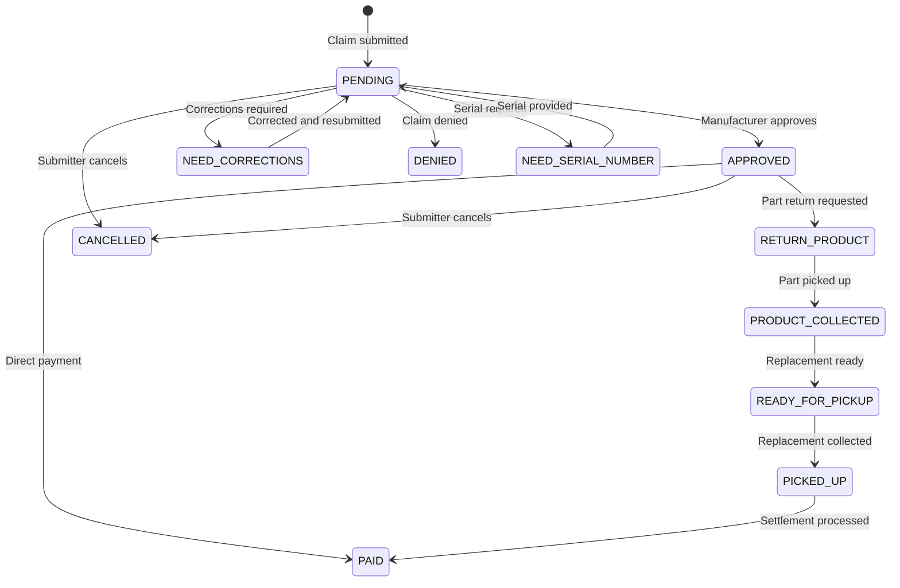

## Claim status flow

Claims progress through a defined set of statuses. Not all statuses apply to every claim type.

## Status reference

| Status | Description | Next possible states |
|--------|-------------|---------------------|
| `ERROR` | System error during processing | — |
| `PENDING` | Claim submitted, awaiting manufacturer review | APPROVED, NEED_CORRECTIONS, DENIED, NEED_SERIAL_NUMBER, CANCELLED |
| `APPROVED` | Manufacturer approved the claim | RETURN_PRODUCT, PAID, CANCELLED |
| `RETURN_PRODUCT` | Manufacturer requests the defective unit be returned | PRODUCT_COLLECTED |
| `PRODUCT_COLLECTED` | Defective unit has been picked up | READY_FOR_PICKUP |
| `READY_FOR_PICKUP` | Replacement product is ready for pickup | PICKED_UP |
| `PICKED_UP` | Replacement product has been collected | PAID |
| `DENIED` | Claim denied by manufacturer | *(terminal)* |
| `CANCELLED` | Claim cancelled by submitter | *(terminal)* |
| `NEED_SERIAL_NUMBER` | Manufacturer needs the serial number to proceed | PENDING |
| `NEED_CORRECTIONS` | Manufacturer needs corrections before approval | PENDING |
| `PAID` | Claim has been settled and paid | *(terminal)* |

## What triggers transitions

**PENDING → APPROVED** — The manufacturer reviews the claim and accepts it. This triggers [Phase 4](/warranty-hub/warranty-flow#phase-4-handle-the-defective-part) (vendor return or scrap) and [Phase 5](/warranty-hub/warranty-flow#phase-5-credit-the-customer) (credit the customer).

**PENDING → NEED_CORRECTIONS** — The manufacturer found issues (missing info, invalid codes, incomplete documentation). Continuum updates the claim via `PATCH /claim` and resubmits.

**PENDING → DENIED** — The claim was rejected. Common reasons: expired coverage, non-covered failure, missing registration, unauthorized contractor.

**APPROVED → RETURN_PRODUCT** — The manufacturer wants the defective part returned before issuing payment. This triggers the [vendor return flow](/warranty-hub/vendor-returns).

**→ PAID** — The manufacturer has processed the settlement. This is the terminal success state.

## OEM-specific status mapping

Each manufacturer has their own status vocabulary. The integration normalizes these to the standard statuses above. For example, Rheem uses statuses like "IN PROCESS-SUBMITTED", "CORRECTIONS-NEEDED", and "FULLY-PAID" which map to APPROVED, NEED_CORRECTIONS, and PAID respectively.
