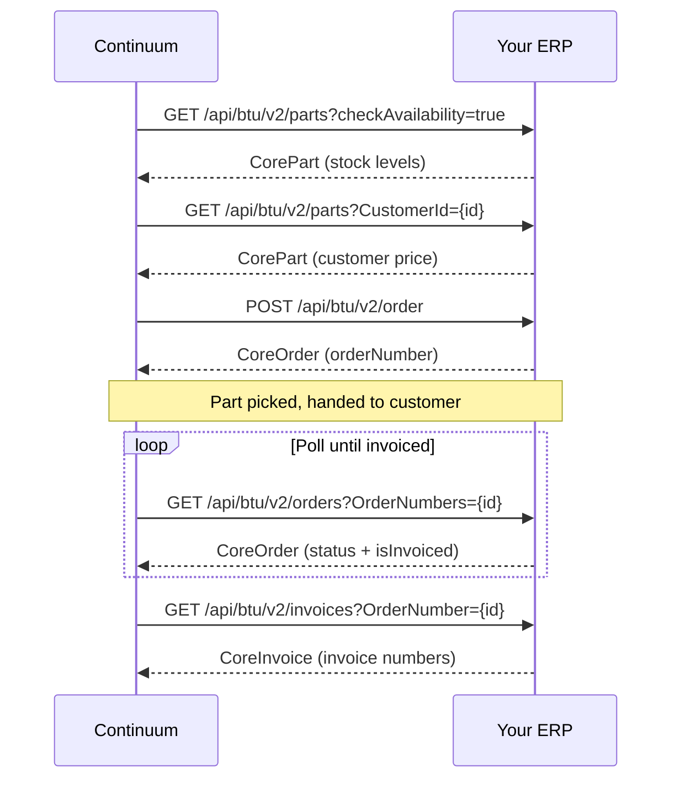

## Overview

When a defective part is identified and covered under warranty, Continuum creates a sales order in your ERP for the replacement. In a typical warranty scenario, the customer is at the distributor's counter — the replacement part is picked and handed to them directly.

## The flow

<Accordion title="Endpoints → API reference">

| Method | V2 endpoint | API reference | V2 entity |
|--------|-------------|---------------|-----------|
| GET | `/api/btu/v2/parts?checkAvailability=true` | [Availability](/api-reference/products/availability) | [CorePart](/data-types/core-objects#corepart) |
| GET | `/api/btu/v2/parts?CustomerId={id}` | [Customer pricing](/api-reference/products/pricing-customer) | [CorePart](/data-types/core-objects#corepart) |
| POST | `/api/btu/v2/order` | [Create order](/api-reference/orders/create-order) | [CoreOrder](/data-types/core-objects#coreorder) |
| GET | `/api/btu/v2/order/{orderNumber}` | [Get order](/api-reference/orders/get-order) | [CoreOrder](/data-types/core-objects#coreorder) |
| GET | `/api/btu/v2/orders?OrderNumbers={id}` | [Order status](/api-reference/orders/order-status) | [CoreOrder](/data-types/core-objects#coreorder) |
| GET | `/api/btu/v2/invoices?OrderNumber={id}` | [Order invoices](/api-reference/orders/order-invoices) | [CoreInvoice](/data-types/core-objects#coreinvoice) |

</Accordion>

## Endpoints

### Core (required)

| Method | V2 endpoint | API reference |
|--------|-------------|---------------|
| GET | `/api/btu/v2/parts?checkAvailability=true` | [Availability](/api-reference/products/availability) |
| GET | `/api/btu/v2/parts?CustomerId={id}` | [Customer pricing](/api-reference/products/pricing-customer) |
| POST | `/api/btu/v2/order` | [Create order](/api-reference/orders/create-order) |
| GET | `/api/btu/v2/orders?OrderNumbers={id}` | [Order status](/api-reference/orders/order-status) |
| GET | `/api/btu/v2/invoices?OrderNumber={id}` | [Order invoices](/api-reference/orders/order-invoices) |
| GET | `/api/btu/v2/order/{orderNumber}` | [Get order](/api-reference/orders/get-order) |

### Additional operations

These depend on your business rules. In V2, all modifications are `PUT` operations on the [`CoreOrder`](/data-types/core-objects#coreorder) entity — updating the relevant fields (add items to `items[]`, set `status: "CANCELLED"`, update `items[].unitPrice`, etc.).

| Operation | V2 approach |
|-----------|-------------|
| Add lines | `PUT /api/btu/v2/order/{orderNumber}` — append to `items[]` |
| Cancel order | `PUT /api/btu/v2/order/{orderNumber}` — set `status: "CANCELLED"` |
| Cancel lines | `PUT /api/btu/v2/order/{orderNumber}` — set `items[].lineStatus: "CANCELLED"` |
| Update pricing | `PUT /api/btu/v2/order/{orderNumber}` — update `items[].unitPrice` |
| Update quantities | `PUT /api/btu/v2/order/{orderNumber}` — update `items[].quantity` |

## Why the invoice matters

The manufacturer needs proof that the replacement was actually provided to the customer. The invoice number — along with the replacement order number — is submitted as part of the warranty claim in [Phase 3](/warranty-hub/warranty-flow#phase-3-file-the-warranty-claim). No invoice = no claim.

Continuum polls [`GET /api/btu/v2/orders`](/api-reference/orders/order-status) in a batch loop until `isInvoiced` comes back `true`. Once invoiced, the flow proceeds to claim submission.
