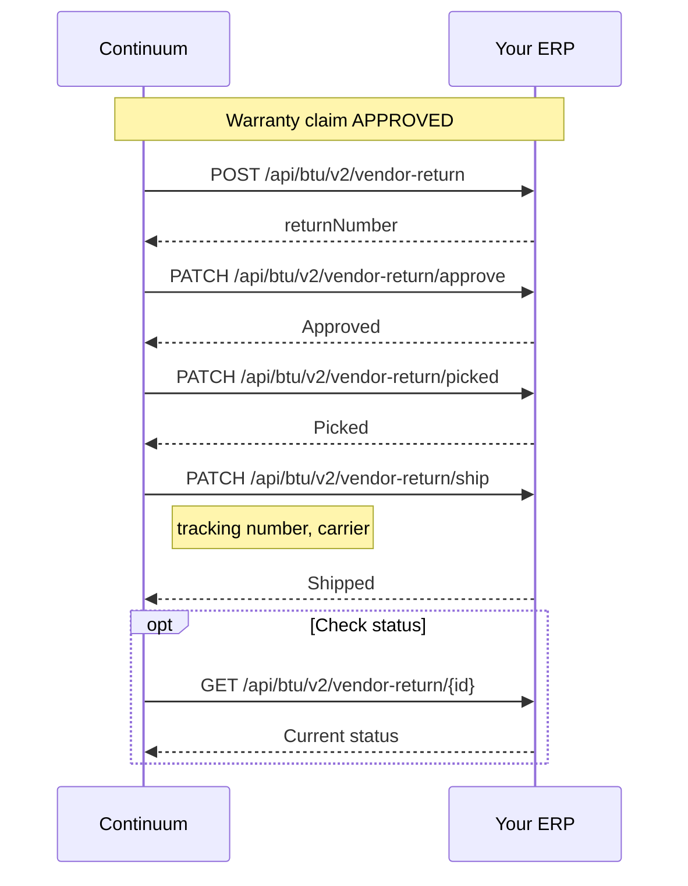

## Overview

After a warranty claim is approved by the manufacturer, the defective part either goes back to the OEM or is scrapped in the field. When the manufacturer wants the part returned, Continuum creates a vendor return in your ERP to manage the reverse logistics.

## The flow

<Accordion title="Endpoints → API reference">

| Method | V2 endpoint | API reference |
|--------|-------------|---------------|
| POST | `/api/btu/v2/vendor-return` | [Create vendor return](/api-reference/vendor-returns/create-vendor-return) |
| GET | `/api/btu/v2/vendor-return/{id}` | [Get vendor return](/api-reference/vendor-returns/get-vendor-return) |
| PATCH | `/api/btu/v2/vendor-return` | [Update vendor return](/api-reference/vendor-returns/update-vendor-return) |
| PATCH | `/api/btu/v2/vendor-return/approve` | [Approve](/api-reference/vendor-returns/approve) |
| PATCH | `/api/btu/v2/vendor-return/picked` | [Picked](/api-reference/vendor-returns/picked) |
| PATCH | `/api/btu/v2/vendor-return/ship` | [Ship](/api-reference/vendor-returns/ship) |

</Accordion>

## Vendor return lifecycle

| Status | Meaning |
|--------|---------|
| DRAFT | Vendor return created, not yet approved |
| APPROVED | Ready for warehouse processing |
| PICKED | Warehouse staff have picked the items |
| SHIPPED | Items shipped to vendor with tracking info |
| RECEIVED | Vendor confirmed receipt |
| CLOSED | Vendor return complete |
| CANCELLED | Vendor return cancelled |

## Endpoints

### Core lifecycle

| Method | V2 endpoint | API reference |
|--------|-------------|---------------|
| POST | `/api/btu/v2/vendor-return` | [Create vendor return](/api-reference/vendor-returns/create-vendor-return) |
| GET | `/api/btu/v2/vendor-return/{id}` | [Get vendor return](/api-reference/vendor-returns/get-vendor-return) |
| PATCH | `/api/btu/v2/vendor-return` | [Update vendor return](/api-reference/vendor-returns/update-vendor-return) |
| PATCH | `/api/btu/v2/vendor-return/approve` | [Approve](/api-reference/vendor-returns/approve) |
| PATCH | `/api/btu/v2/vendor-return/picked` | [Picked](/api-reference/vendor-returns/picked) |
| PATCH | `/api/btu/v2/vendor-return/ship` | [Ship](/api-reference/vendor-returns/ship) |

### Additional operations

| Operation | V2 endpoint |
|-----------|-------------|
| Add lines | `PATCH /api/btu/v2/vendor-return/add-lines` |
| Delete lines | `PATCH /api/btu/v2/vendor-return/delete-lines` |
| Update quantities | `PATCH /api/btu/v2/vendor-return/quantity` |
| Update pricing | `PATCH /api/btu/v2/vendor-return/price` |
| Cancel | `PATCH /api/btu/v2/vendor-return/cancel` |

## Scrap-in-field alternative

Not all defective parts go back to the manufacturer. Some manufacturers authorize scrap for low-value parts or remote locations. When scrap-in-field is the disposition, no vendor return is created — the claim record in Continuum is updated to reflect the scrap disposition, and the flow proceeds directly to [Phase 5: Credit the customer](/warranty-hub/warranty-flow#phase-5-credit-the-customer).
