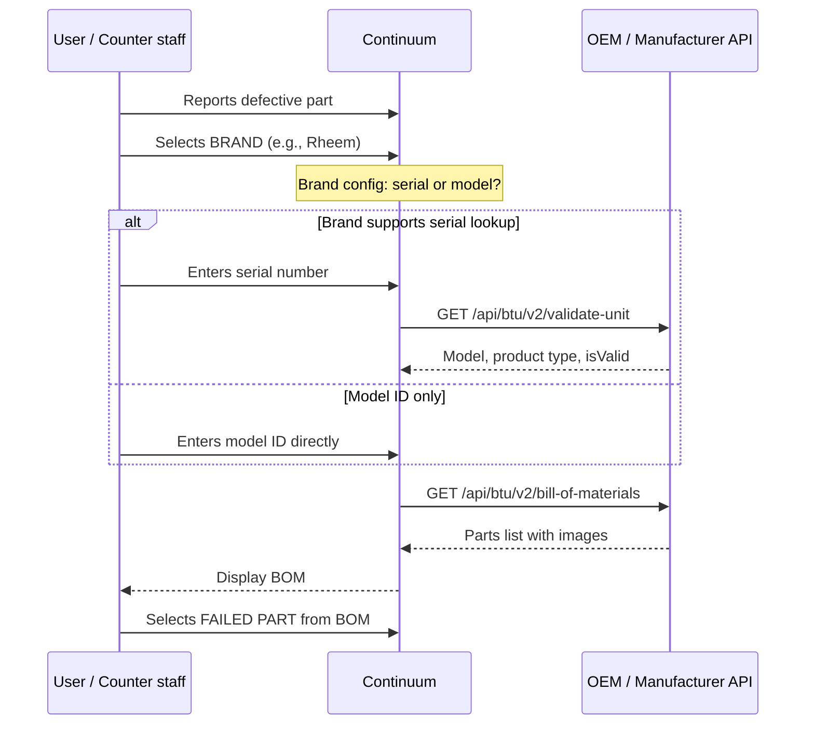
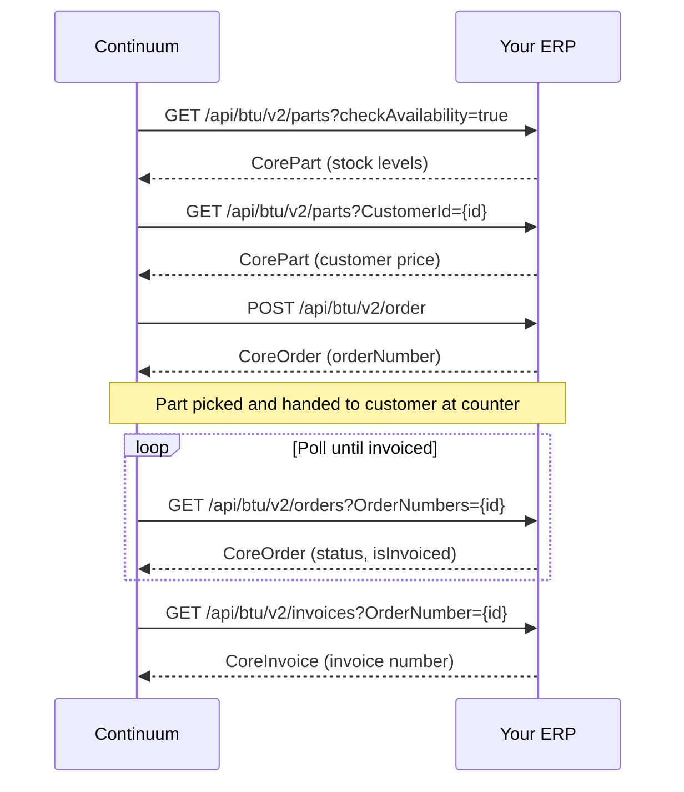
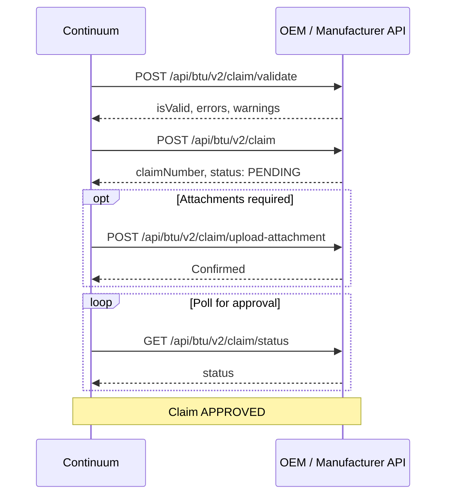

## Overview

This is the end-to-end sequence for a warranty event. It starts when a distributor's customer reports a defective part and ends when the customer receives a credit that offsets their replacement order.

<Info>
**Three hubs, one flow.** This orchestration touches the Claims Hub (OEM), the Warranty Hub (ERP), and the Returns Hub (ERP). Each phase is labeled with which hub and system it talks to.
</Info>

---

## Phase 0: Invoice caching (background)

Before any warranty event occurs, Continuum periodically bulk-loads invoices from your ERP so that invoice data is available immediately when a claim starts.

```
Continuum → GET /api/btu/v2/invoices (date range, scheduled)
→ Returns CoreInvoice[] with CoreInvoiceLineItem[]
→ Cached locally in Continuum
```

This runs on a schedule. By the time a warranty event begins, Continuum already knows what was sold, when, and at what price.

<Accordion title="Endpoints → API reference">

| Method | V2 endpoint | API reference | V2 entity |
|--------|-------------|---------------|-----------|
| GET | `/api/btu/v2/invoices` | [Search invoices](/api-reference/invoices/search-invoices) | [CoreInvoice](/data-types/core-objects#coreinvoice) |
| GET | `/api/btu/v2/invoice/{invoiceNumber}` | [Invoice details](/api-reference/invoices/invoice-details) | [CoreInvoice](/data-types/core-objects#coreinvoice) + [CoreInvoiceLineItem](/data-types/core-objects#coreinvoicelineitem) |

</Accordion>

---

## Phase 1: Identify the defect

**Hub:** Warranty Claims → OEM

The customer reports a defective part. Continuum walks them through identifying exactly what failed.



<Accordion title="Endpoints → API reference">

| Method | V2 endpoint | API reference | Notes |
|--------|-------------|---------------|-------|
| GET | `/api/btu/v2/validate-unit` | [Validate unit](/api-reference/unit-data/validate-unit) | Conditional — only when brand supports serial lookup |
| GET | `/api/btu/v2/bill-of-materials` | [Bill of materials](/api-reference/parts/bill-of-materials) | Returns parts list for the unit |
| GET | `/api/btu/v2/claim-types` | *(Claims Hub)* | Available claim types for this serial/model |
| GET | `/api/btu/v2/products/replacements` | [Replacement parts](/api-reference/parts/replacements) | Handles superseded parts |
| GET | `/api/btu/v2/products/reason-codes` | [Warranty codes](/api-reference/parts/warranty-codes) | Part-specific failure reason codes |

</Accordion>

**① Brand selection** — The customer selects the brand of the defective part. This routes to the correct manufacturer API.

**② Serial or model?** — Brand configuration determines whether a serial number or just a model ID is needed.

**③ Validate unit** *(conditional)* — Only called when the brand supports serial lookup. [`GET /api/btu/v2/validate-unit`](/api-reference/unit-data/validate-unit) validates the serial and returns unit info.

**④ BOM lookup** — [`GET /api/btu/v2/bill-of-materials`](/api-reference/parts/bill-of-materials) retrieves the full parts list. The customer selects which part failed.

---

## Phase 2: Replace the part

**Hub:** Warranty → ERP

The replacement part is located, priced, and handed to the customer at the counter.



<Accordion title="Endpoints → API reference">

| Step | Method | V2 endpoint | API reference | V2 entity |
|------|--------|-------------|---------------|-----------|
| ⑤ | GET | `/api/btu/v2/parts?checkAvailability=true` | [Availability](/api-reference/products/availability) | [CorePart](/data-types/core-objects#corepart) |
| ⑥ | GET | `/api/btu/v2/parts?CustomerId={id}` | [Customer pricing](/api-reference/products/pricing-customer) | [CorePart](/data-types/core-objects#corepart) |
| ⑦ | POST | `/api/btu/v2/order` | [Create order](/api-reference/orders/create-order) | [CoreOrder](/data-types/core-objects#coreorder) |
| ⑧ | GET | `/api/btu/v2/orders?OrderNumbers={id}` | [Order status](/api-reference/orders/order-status) | [CoreOrder](/data-types/core-objects#coreorder) |
| ⑧ | GET | `/api/btu/v2/invoices?OrderNumber={id}` | [Order invoices](/api-reference/orders/order-invoices) | [CoreInvoice](/data-types/core-objects#coreinvoice) |

</Accordion>

**⑤ Check inventory** — [`GET /api/btu/v2/parts?checkAvailability=true`](/api-reference/products/availability) — Is the replacement part in stock at the branch?

**⑥ Get pricing** — [`GET /api/btu/v2/parts?CustomerId={id}`](/api-reference/products/pricing-customer) — Customer-specific price. The customer pays up front — the credit comes later.

**⑦ Create replacement order** — [`POST /api/btu/v2/order`](/api-reference/orders/create-order) — Continuum creates the sales order as a [`CoreOrder`](/data-types/core-objects#coreorder). The part is typically picked and handed directly to the customer at the counter.

**⑧ Wait for invoice** — [`GET /api/btu/v2/orders`](/api-reference/orders/order-status) — Continuum polls until the order is invoiced. **The flow cannot proceed to the claim phase until the replacement order is invoiced.**

<Warning>
**Gate:** No invoice = no claim. The manufacturer needs proof that the replacement was provided. The invoice number is a required input to the warranty claim.
</Warning>

---

## Phase 3: File the warranty claim

**Hub:** Warranty Claims → OEM

The replacement order is invoiced. Continuum gathers the claim details and submits to the manufacturer.

Continuum assembles:
- **Homeowner info** — name, address, phone, email
- **Original purchase invoice** — from cached invoice data
- **Distributor or contractor of record** — who sold/installed the unit
- **Replacement order number + invoice number** — proof the replacement was provided
- **Failed part details** — part number, serial number, failure reason code
- **Install date, site information**

The claim details are saved in Continuum, then submitted — either automatically via API or manually by a user.



<Accordion title="Endpoints → API reference">

| Method | V2 endpoint | API reference | Notes |
|--------|-------------|---------------|-------|
| POST | `/api/btu/v2/claim/validate` | *(Claims Hub)* | Pre-validate (dry run) |
| POST | `/api/btu/v2/claim` | *(Claims Hub)* | Submit the claim |
| POST | `/api/btu/v2/claim/upload-attachment` | *(Claims Hub)* | Upload supporting docs |
| GET | `/api/btu/v2/claim/status` | *(Claims Hub)* | Poll for status |
| PATCH | `/api/btu/v2/claim` | *(Claims Hub)* | Update if corrections needed |

See [Claim flow](/warranty-claims-hub/claim-flow) for full endpoint specs.

</Accordion>

<Warning>
**Gate:** Claim must be approved before proceeding to Phase 4 and 5.
</Warning>

---

## Phase 4: Handle the defective part

**Hub:** Warranty → ERP

The claim is approved. The defective part either goes back to the manufacturer or is scrapped in the field.

<Tabs>
  <Tab title="Return to vendor">
    Continuum creates a vendor return order in the ERP:

    1. [`POST /api/btu/v2/vendor-return`](/api-reference/vendor-returns/create-vendor-return) — Create the vendor return
    2. [`PATCH /api/btu/v2/vendor-return/approve`](/api-reference/vendor-returns/approve) — Approve for warehouse processing
    3. [`PATCH /api/btu/v2/vendor-return/picked`](/api-reference/vendor-returns/picked) — Mark items as picked
    4. [`PATCH /api/btu/v2/vendor-return/ship`](/api-reference/vendor-returns/ship) — Record shipment with tracking info

    [Vendor returns detail →](/warranty-hub/vendor-returns)
  </Tab>
  <Tab title="Scrap in field">
    No vendor return is created. The claim record in Continuum is updated to reflect scrap disposition. Some manufacturers authorize scrap for low-value parts or remote locations.
  </Tab>
</Tabs>

---

## Phase 5: Credit the customer

**Hub:** Returns → ERP

The RMA that was created in draft at the beginning of the process is now finalized. In V2, all RMA operations are `PUT` updates on the [`CoreRma`](/data-types/core-objects#corerma) entity.

1. [`PUT /api/btu/v2/rma/{rmaNumber}`](/api-reference/returns/acknowledge) — Move RMA from **DRAFT → FINAL**. Signals the credit is authorized.
2. [`PUT /api/btu/v2/rma/{rmaNumber}`](/api-reference/returns/receive) — Receive the defective part (or record the scrap disposition).
3. [`PUT /api/btu/v2/rma/{rmaNumber}`](/api-reference/returns/credit-lines) — Issue a credit memo that **offsets the replacement sales order**.

The customer's net cost is zero (or reduced, depending on warranty terms) — they paid for the replacement up front in Phase 2 and now receive a matching credit.

<Tip>
The replacement order and the credit are separate ERP transactions. The sales order charges the customer; the RMA credit reimburses them. This keeps the accounting clean — each transaction stands on its own, and the warranty claim is the business justification connecting them.
</Tip>

---

## Phase summary

| Phase | Hub | Talks to | Key gate |
|-------|-----|----------|----------|
| 0. Invoice caching | Returns | ERP | Background — no gate |
| 1. Identify the defect | Claims | OEM | — |
| 2. Replace the part | Warranty | ERP | **Order must be invoiced** |
| 3. File the claim | Claims | OEM | **Claim must be approved** |
| 4. Handle defective part | Warranty | ERP | — |
| 5. Credit the customer | Returns | ERP | — |
